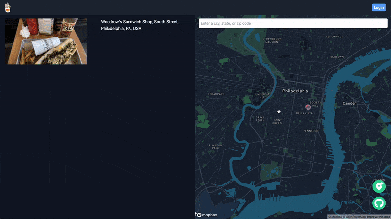

<!-- markdownlint-disable-file MD033 -->

<h1 align="center"> Good Global Eats </h1> <br>
<p align="center">
    <a href="https://good-global-eats.vercel.app/">
        
        
    </a>
</p>

<p align="center" > Good Eats Across The Globe! </p>
<p align="center" > <a href="https://good-global-eats.vercel.app/"> 🍣 LINK TO LIVE SITE </a></p>

## Table of Contents

1. [Overview](#overview)
    - [Technologies](#technologies)
    - [Libraries & Methodologies](#libraries--methodologies)
2. [Features](#features)
3. [Technical Implementation Details](#technical-implementation-details)
    - [Data Flickering](#data-flickering)
    - [Server Side Auth](#server-side-auth)
4. [TODOs / Features to implement](#todos--features-to-implement)
5. [Author Info](#author-info)


## Overview

Good Global Eats is a full stack restaurant-sharing app inspired by Airbnb's split map UI design. Find your next good eats anywhere in the world or put other users on to your own favorite spots.

### Technologies

- Next.js
- TypeScript
- GraphQL
- PostgreSQL
- Tailwind CSS
- Cloudinary
- Firebase Auth
- Mapbox
- Google Places

### Libraries & Methodologies

- [Prisma](https://github.com/prisma/prisma) for data modeling, migrations, and data access to the PostgreSQL database.
- [Apollo Client](https://github.com/apollographql/apollo-client) for GraphQL querires and mutations.
- [Apollo Server](https://github.com/apollographql/apollo-server) for establishing self-documenting GraphQL server.
- [geolib](https://github.com/manuelbieh/geolib) for calculating coordinates bounds to find nearby restaurants.
- [React Hook Form](https://github.com/react-hook-form/react-hook-form) for upload post form validations. 
- [react-map-gl](https://github.com/visgl/react-map-gl) for Mapbox markers and pop-ups.

## Features

- *USER AUTH*
  - Login, Create Account
  - or explore as guest / demo-user


- *MAP*
  - Search for an area, a city, or country
  - Open a preview of the restaurants
  - Zoom in/out or move the map to show posted restaurants within the visible map


- *RESTAURANT POSTS*
  - Search for restaurants by name or address
  - Upload recommended menu items with an image
  - Delete or edit your own posts



[Back To The Top :arrow_up_small:](#table-of-contents)

## Technical Implementation Details

### Data Flickering
When Apollo is performing GraphQL queries while a user is interacting with the map (zooming in/out, dragging), it returns `undefined` before it returns the desired data. While Apollo is in the loading state, it doesn't give me access to the previous data, even if the new data being returned is the same as before the loading state. <br>
To prevent this, I implemented a custom hook that takes in data from Apollo and returns when it's not `undefined` or `null`.

```javascript
// src/utils/useLastData.ts

export function useLastData<S>(data: S) {
  const ref = useRef(data);
  if (data !== null && data !== undefined) {
    ref.current = data;
  }

  return ref.current;
}
```

`useRef` instead of `useState` to prevent unnecessary rerenders.

```javascript
// pages/index.tsx

export default function Spot() {
  const [dataBounds, setDataBounds] = useLocalState<string>(
    "bounds",
    "[[0,0],[0,0]]"
  );

  // reduce the amount of queries called to the apollo server when zooming in/out of map
  const [debouncedDataBounds] = useDebounce(dataBounds, 200);
  const { data, error } = useQuery<SpotsQuery, SpotsQueryVariables>(
    SPOTS_QUERY,
    {
      variables: { bounds: parseBounds(debouncedDataBounds) },
    }
  );

  // custom hook to prevent data flickering (undefined) when querying SPOTS_QUERY
  const lastData = useLastData(data);
  
  return (
    <>
      ....
      <Map
        setDataBounds={setDataBounds}
        spots={lastData ? lastData.spots : []}
        ....
      />
    </>
  )
}
```

[Back To The Top :arrow_up_small:](#table-of-contents)


### Server Side Auth
Visiting protected routes such as edit/putOn pages re-routes unauthorized users to the login/signup page on the server side before the requested page is served to the front-end.
`getServerSideProps` method provided by Next.js is used to check if the user is authenticated on the server side to re-route them accordingly.

```javascript
// pages/spots/putOn.tsx

export default function PutOn() {
  return <Layout main={<SpotForm />} />;
}

// intercept putOn route access
// redirect to "/auth" if not logged in
export const getServerSideProps: GetServerSideProps = async ({ req, res }) => {
  const uid = await loadIdToken(req as NextApiRequest);

  if (!uid) {
    res.setHeader("location", "/auth");
    res.statusCode = 302;
    res.end();
  }

  return { props: {} };
};
```

Unauthorized users are sent to `/auth` page to login/signup with the status code of 302 (`redirect`)

[Back To The Top :arrow_up_small:](#table-of-contents)


## TODOs / Features to implement

- [ ] Map clusters for when markers overlap each other
- [ ] Like/Dislike for posts
- [ ] User page with their posts

[Back To The Top :arrow_up_small:](#table-of-contents)

---

## Author Info

- Ryan Naing - [Portfolio](https://RyanNaing.com)


[Back To The Top :arrow_up_small:](#table-of-contents)
